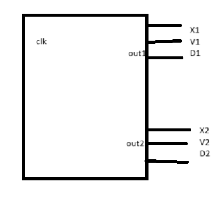
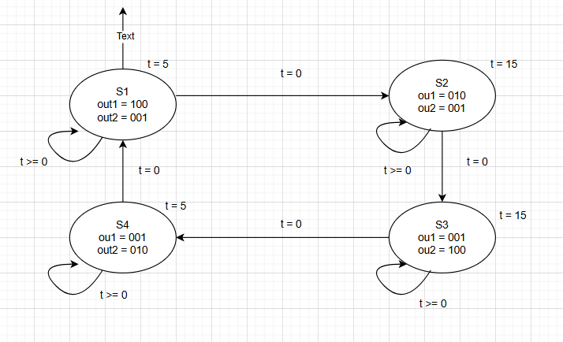
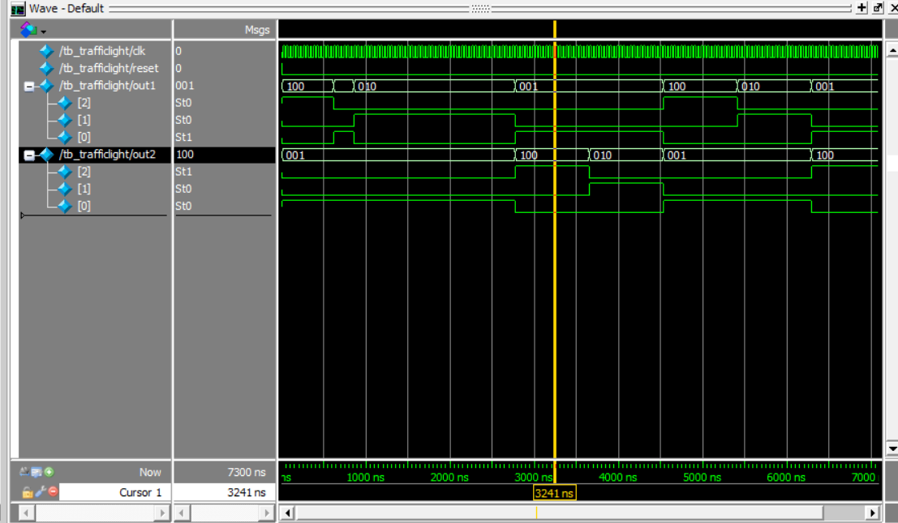

# Den GT

## 1. Đề bài 
- Thiết kế đèn giao thông có 2 ngõ ra 2 trụ đèn tín hiệu thời gian từ Xanh 15s, Vàng 5S và đỏ 20s


## 2. Phân tích
| Trạng thái | Đầu ra 1 (out1) | Đầu ra 2 (out2) | Thời gian (giây) |
| :--------: | :-------------: | :-------------: | :--------------: |
|     S1     |       100       |       001       |        15        |
|     S2     |       010       |       001       |        5         |
|     S3     |       001       |       100       |        15        |
|     S4     |       001       |       010       |        5         |

- Sơ đồ nguyên lý 


- Code: [Link](https://github.com/giunzz/DDCS336764/blob/main/Chapter%206/IC_Desgin/DENGT.v)


## 4. test bernch 

```verilog
`timescale 1ns/1ns 
module tb_trafficlight;
reg clk, reset;
wire [2:0] out1,out2;  

initial begin 
clk = 0;
reset = 1;
#10 reset = 0;
end

always forever #20 clk = ~clk; 
traffic_light uut(clk, reset, out1, out2 );
endmodule 

```
