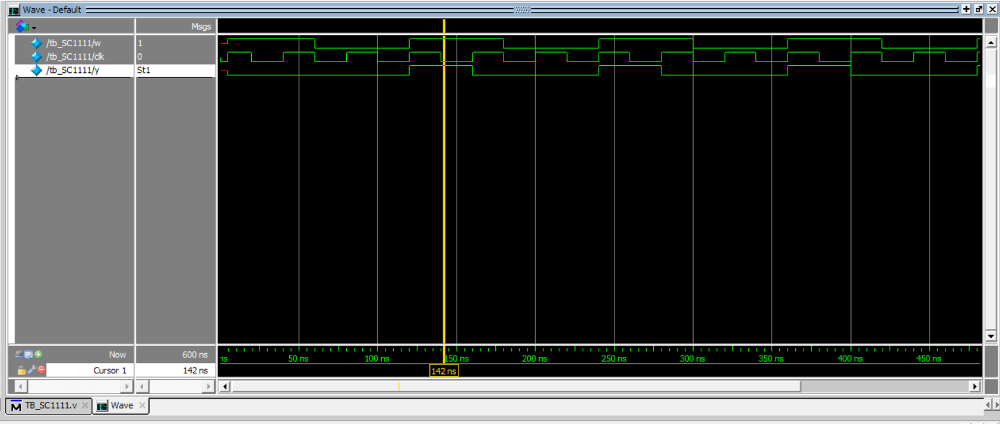

# Phát hiện chuỗi

## 1. Đề bài 
- Thiết kế mô phỏng phát hiện chuỗi **1001** trong chuỗi dữ liệu nối tiếp
- W: dữ liệu nối tiếp vào theo xung Clk cạnh xuống
- Nếu phát hiện **1001** thì output y = 1 ngược lại y = 0

## 2. Verilog mô tả 
```v
module seq4_detect_moore(x, clk, y);
  input x, clk;
  output reg y;
  reg [2:0] state, nstate; 
  parameter S0 = 3'b000, S1 = 3'b001, S2 = 3'b010, S3 = 3'b011;

  // State register (flip-flop)
  always @(posedge clk) begin
    state <= nstate;
  end

  // Next state logic (state transitions)
  always @(state or x) begin
    case(state)
      S0: nstate = (x) ? S1 : S0;  // Looking for '1'
      S1: nstate = (x) ? S1 : S2;  // Looking for '10'
      S2: nstate = (x) ? S0 : S3;  // Looking for '100'
      S3: nstate = (x) ? S1 : S0;  // Looking for '1001'
      default: nstate = S0;  // Default case (reset to S0)
    endcase
  end

  always @(state) begin
    if(state == S3)
      y = 1;
    else
      y = 0;
  end
endmodule
```

## 3. Test

```v
`timescale 1ns/1ns 
module tb_SC1111;
reg w, clk;
wire  y;
initial begin 
clk = 0;
#5;
clk = 1;
w = 1;
end
always forever #20 clk = ~clk; 
always forever #60 w = ~w;
seq4_detect_moore  uut(w,clk, y );

endmodule 
```

## 4. Stimulate


