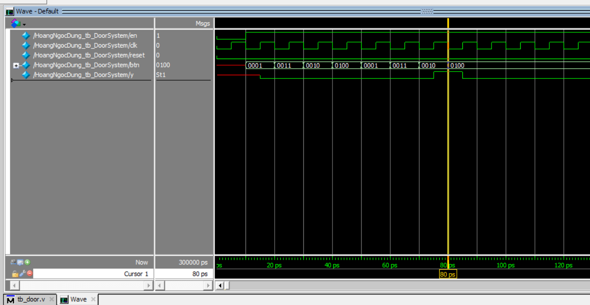
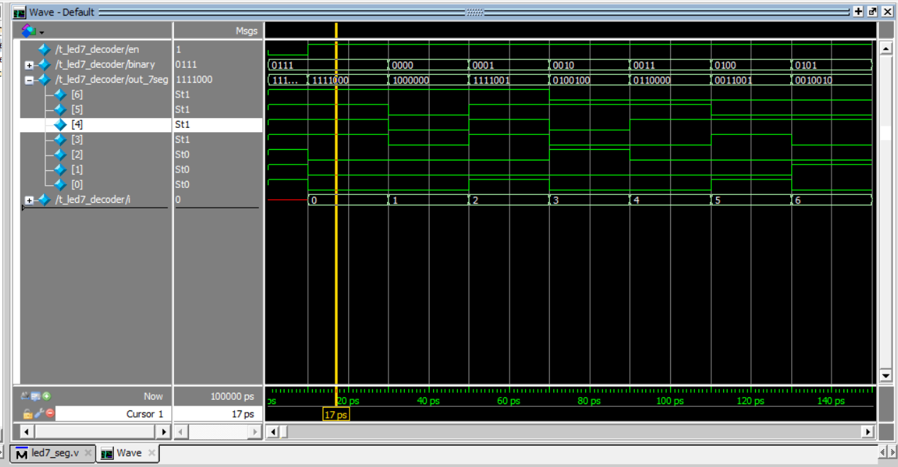

# Password door

## 1. Đề bài 
Thiết kế hệ thống khóa cửa đơn giản hệ thống sử dụng một bàn phím giả lập bang 4 nút nhấn tương ứng với 1,2,3,4

- Mật khẩu mở cửa là 1,3,2,4
- Mỗi người khi dung cửa hệ thống kireerm tra xem nhập dung hay không 
- Nếu dung , đènn led xanh bậc sáng 3s de báo mở cửa
- Nếu sai, den đỏ nhấp nháy 3 lần de báo sai mật khẩu sau do he thong quay lai trạng thái ban đầu.
- Nếu không có thao tác trong vòng 10s quay lai trạng thái ban dau. 

Yêu cầu so do he thong, phân tích 

### 2. FSM 
- **Yêu cầu**: Nhập mật khẩu từ nút nhấn. Kiểm tra xem mật khẩu đúng hay không. Mật khẩu đúng là chuỗi **"1,3,2,4"**

- Nếu không có thao tác trong vòng 10s quay lai trạng thái ban dau.
- Khi nhập sai quay về trạng thái ban đầu 

***a. Code verilog***

- 
```v
module Door_System(
input wire [3:0] btn,
input wire clk, reset,
output reg y
);

reg [2:0] state, next_state; 
reg [11:0] seq; // input seq 

reg [3:0] timer; // 10 time count 

parameter S0 = 0 , S1 = 1 , S2 = 2 , S3 = 3, S4 = 4, error = 5;

parameter TIME_OUT  = 10;

// reset 
always @(posedge reset)
if (reset) 
begin 
	state <= S0;
	seq <= 0; 
	y <= 0;
	timer = 0;
end

// time count
always @(posedge clk)
if (timer == TIME_OUT) 
begin 
	state <= S0;
	seq <= 0; 
	y <= 0;
	timer = 0;
end
else if (btn != 0) 
	timer <= 0;
else 
	timer <= timer + 1;

    
// FSM : thay đổi trạng thái 
always @(posedge clk) 
case(state)
S0: if (btn[0] == 1) 
begin 
	seq[2:0] = 1;
	next_state <= S1;
end else 
	next_state <= S0;
S1: if (btn[2] == 1)
begin 
	seq[5:3] = 3;
	next_state <= S2;
end
else if (btn[1] || btn[3] || btn[0])  
	next_state <= error;
S2: if (btn[1] == 1) 
begin 
	seq[8:6] = 2;
	next_state <= S3;
end
else if (btn[2] || btn[3] || btn[0])  
	next_state <= error;
S3: if (btn[3] == 1) 
begin 
	seq[11:9] = 4;
	next_state <= S4; 
end
else if (btn[1] || btn[2] || btn[0])  
	next_state <= error;
error:
	next_state  <= S0;
default: next_state  <= S0; 
endcase

// cập nhật trạng thái
always @(posedge clk) 
      state <= next_state;

// output
always @(state) begin
    if(state == S3)
      y = 1;
    else
      y = 0;
end

endmodule 
```


> Ta thấy sau khi nhấn button 1,3,2,4 thì tín hiệu mở cửa (y = 1)

### 3. Led 7 đoạn 

- Code verilog 

```v
module led7_decoder(
    i_en,
    i_binary,
    o_7seg
);

    input i_en;
    input [3:0] i_binary;
    output [6:0] o_7seg; // anode chung 1 tắt 0 sáng 

    reg [6:0] value_7seg;

    always @ (i_binary) begin
        case (i_binary)
            4'h0: value_7seg = 7'b1000000;
            4'h1: value_7seg = 7'b1111001;
            4'h2: value_7seg = 7'b0100100;
            4'h3: value_7seg = 7'b0110000;
            4'h4: value_7seg = 7'b0011001;
            4'h5: value_7seg = 7'b0010010;
            4'h6: value_7seg = 7'b0000010;
            4'h7: value_7seg = 7'b1111000;
            4'h8: value_7seg = 7'b0000000;
            4'h9: value_7seg = 7'b0010000;
            4'hA: value_7seg = 7'b0001000;
            4'hB: value_7seg = 7'b0000011;
            4'hC: value_7seg = 7'b1000110;
            4'hD: value_7seg = 7'b0100001;
            4'hE: value_7seg = 7'b0000110;
            4'hF: value_7seg = 7'b0001110;
            default: value_7seg = 7'b1111111;
        endcase
    end

    assign o_7seg = i_en ? value_7seg : 7'b1111111;

endmodule
```
- test bench

```v
module t_led7_decoder();

    reg en;
    reg [3:0] binary;

    wire [6:0] out_7seg;

    led7_decoder UUT(
        .i_en(en),
        .i_binary(binary),
        .o_7seg(out_7seg)
    );
    integer i;
    initial begin
        binary = 4'h7; // ban đầu chưa enable
        en = 0;
        #10 en = 1;
        for (i = 0; i < 16; i = i + 1) begin // chạy từ 0 đến 15 để kiểm tra
            #20 binary = i;
        end
    end
endmodule

```

- Stimulate 




### 5. Full code  and test
```v
module Door_System(
input wire [3:0] btn,
input wire clk, reset,
output reg y,
output reg green_led,  
output reg red_led  
);

reg [2:0] state, next_state; 
reg [11:0] seq; // input seq 

reg [3:0] timer; // 10 time count 
reg [3:0] led_timer; // 3s 

parameter S0 = 0 , S1 = 1 , S2 = 2 , S3 = 3, S4 = 4, error = 5;

parameter TIME_OUT  = 10, led_on = 3, led_blink = 1;

// reset 
always @(posedge reset)
if (reset) 
begin 
	state <= S0;
	seq <= 0; 
	y <= 0;
	timer <= 0;
	green_led <= 0;
	red_led <= 0;
	led_timer <= 0;
end

// time count
always @(posedge clk)
if (timer == TIME_OUT) 
begin 
	state <= S0;
	seq <= 0; 
	y <= 0;
	timer = 0;
	green_led <= 0;
    red_led <= 0;
end
else if (btn != 0) 
	timer <= 0;
else 
	timer <= timer + 1;

    
// change state
always @(posedge clk) 
case(state)
S0: if (btn[0] == 1) 
begin 
	seq[2:0] = 1;
	next_state <= S1;
end else 
	next_state <= S0;
S1: if (btn[2] == 1)
begin 
	seq[5:3] = 3;
	next_state <= S2;
end
else if (btn[1] || btn[3] || btn[0])  
	next_state <= error;
S2: if (btn[1] == 1) 
begin 
	seq[8:6] = 2;
	next_state <= S3;
end
else if (btn[2] || btn[3] || btn[0])  
	next_state <= error;
S3: if (btn[3] == 1) 
begin 
	seq[11:9] = 4;
	next_state <= S3; 
end
else if (btn[1] || btn[2] || btn[0])  
	next_state <= error;
error: next_state  <= S0;

default: next_state  <= S0; 

endcase


always @(posedge clk) 
    state <= next_state;

// output

always @(state) begin
if (state == S3) begin // correct pass -> green light
	y = 1;                             
	green_led = 1;         
        led_timer <= 0;        
end else begin
	y = 0;
	green_led = 0;
	led_timer <= 0; 
end

if (green_led == 1) begin
    if (led_timer < led_on) 
                led_timer <= led_timer + 1;   
    else begin
                green_led = 0;  
                led_timer <= 0;  
            end
end
if (state == error) begin
            if (led_timer < led_blink) begin
                red_led = (led_timer % 2 == 0) ? 1 : 0;  
                led_timer <= led_timer + 1;   
            end else begin
                red_led = 0;      
                led_timer <= 0;    
            end
        end else begin
            red_led = 0;
            led_timer <= 0;      
        end
    end
endmodule 

```

- Test ben
```v
module HoangNgocDung_tb_DoorSystem();

reg clk, reset;
reg [3:0] btn;
wire y, green, red;
    
initial begin

clk = 0;
btn = 0;
reset = 1;
#10 reset = 0;

#10 btn = 1;
#10 btn = 2; 
#10 btn = 4; 
#10 btn = 3; 
#5 reset = 1;
#5 reset = 0;

#10 btn = 1; 
#10 btn = 3; 
#10 btn = 2; 
#10 btn = 4;  

#10 btn = 1; 
#10 btn = 2; 
#10 btn = 2; 
#10 btn = 4;  
end
always forever #5 clk = ~clk; 
always forever #200 reset = ~ reset;
Door_System uut (btn , clk, reset, y, green, red);
endmodule
```


