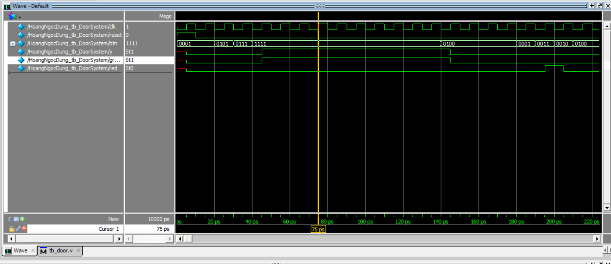

# Password door

## 1. Đề bài 
Thiết kế hệ thống khóa cửa đơn giản hệ thống sử dụng một bàn phím giả lập bang 4 nút nhấn tương ứng với 1,2,3,4

- Mật khẩu mở cửa là 1,3,2,4
- Mỗi người khi dung cửa hệ thống kireerm tra xem nhập dung hay không 
- Nếu dung , đènn led xanh bậc sáng 3s de báo mở cửa
- Nếu sai, den đỏ nhấp nháy 3 lần de báo sai mật khẩu sau do he thong quay lai trạng thái ban đầu.
- Nếu không có thao tác trong vòng 10s quay lai trạng thái ban dau. 

Yêu cầu so do he thong, phân tích 

### 2. Chia nhỏ bài toán 
- **Yêu cầu**: Nhập mật khẩu từ nút nhấn. Kiểm tra xem mật khẩu đúng hay không. Mật khẩu đúng là chuỗi **"1,3,2,4"**. Khi nhập sai quay về trạng thái ban đầu 

- Nếu không có thao tác trong vòng 10s quay lai trạng thái ban dau.


***a. Code verilog***

```v
module Door_System(
    input wire [3:0] btn,
    input wire clk, reset,
    output reg y,
    output reg green_led,  
    output reg red_led  
);

    reg [2:0] state, next_state; 
    reg [11:0] seq; 

    reg [3:0] timer; 
    reg [3:0] time_green, time_red; 

    parameter S0 = 0 , S1 = 1 , S2 = 2 , S3 = 3, S4 = 4, error = 5, success = 6;

    parameter TIME_OUT  = 10;  

    // reset 
    always @(posedge clk) begin
        if (reset) begin
            state <= S0;
            seq <= 12'b0;
            y <= 0;
            timer <= 0;  // Reset timer
            green_led <= 0;
            red_led <= 0;
        end else begin
            state <= next_state;
            if (timer > 0)  
                timer <= timer - 1;  
        end
    end

    // State change (FSM)
    always @(btn, state) begin
        case(state)
            S0: if (btn == 4'b0001) begin
                    seq[2:0] <= 3'b001;  
                    next_state = S1;
                    timer <= TIME_OUT;  
                end else next_state = S0;

            S1: if (btn == 4'b0101) begin
                    seq[5:3] <= 3'b011;  
                    next_state = S2;
                    timer <= TIME_OUT;  
                end else next_state = error;

            S2: if (btn == 4'b0111) begin 
                    seq[8:6] <= 3'b010;  
                    next_state = S3;
                    timer <= TIME_OUT;  
                end else next_state = error;

            S3: if (btn == 4'b1111) begin 
                    seq[11:9] <= 3'b100;  
                    next_state = success;
                    timer <= TIME_OUT;  
                end else next_state = error;

            error: begin
                next_state = S0;
                seq <= 12'b0;  
                timer <= 0;  // Reset timer
            end

            success: begin
                next_state = (timer == 0) ? S0 : success;  
                seq <= 12'b0;  
            end

            default: next_state = S0;
        endcase
    end

    // Output Logic
    always @(state) begin
        y = (state == success) ? 1 : 0;
        green_led = (state == success) ? 1 : 0;  
        red_led = (state == error) ? 1 : 0;  
    end

endmodule  
```
- test

```v
module HoangNgocDung_tb_DoorSystem();

reg clk, reset;
reg [3:0] btn;
wire y, green, red;
    
initial begin
btn = 4'b0001;
reset = 0;
clk = 0;
reset = 1;
#10 reset = 0;
#10 btn = 4'b0101;
#10 btn = 4'b0111;
#10 btn = 4'b1111;

#100 btn = 4;
#40 btn = 1;
#10 btn = 3;
#10 btn = 2;
#10 btn = 4;
end

always forever #5 clk = ~clk; 
Door_System uut (btn , clk, reset, y, green, red);

endmodule
```




> Ta thấy sau khi nhấn button 1,3,2,4 thì tín hiệu mở cửa (y = 1)

### 3. Led 7 đoạn 

- Code verilog 

```v
module led7_decoder(
    i_en,
    i_binary,
    o_7seg
);

    input i_en;
    input [3:0] i_binary;
    output [6:0] o_7seg; // anode chung 1 tắt 0 sáng 

    reg [6:0] value_7seg;

    always @ (i_binary) begin
        case (i_binary)
            4'h0: value_7seg = 7'b1000000;
            4'h1: value_7seg = 7'b1111001;
            4'h2: value_7seg = 7'b0100100;
            4'h3: value_7seg = 7'b0110000;
            4'h4: value_7seg = 7'b0011001;
            4'h5: value_7seg = 7'b0010010;
            4'h6: value_7seg = 7'b0000010;
            4'h7: value_7seg = 7'b1111000;
            4'h8: value_7seg = 7'b0000000;
            4'h9: value_7seg = 7'b0010000;
            4'hA: value_7seg = 7'b0001000;
            4'hB: value_7seg = 7'b0000011;
            4'hC: value_7seg = 7'b1000110;
            4'hD: value_7seg = 7'b0100001;
            4'hE: value_7seg = 7'b0000110;
            4'hF: value_7seg = 7'b0001110;
            default: value_7seg = 7'b1111111;
        endcase
    end

    assign o_7seg = i_en ? value_7seg : 7'b1111111;

endmodule
```
- test bench

```v
module t_led7_decoder();

    reg en;
    reg [3:0] binary;

    wire [6:0] out_7seg;

    led7_decoder UUT(
        .i_en(en),
        .i_binary(binary),
        .o_7seg(out_7seg)
    );
    integer i;
    initial begin
        binary = 4'h7; // ban đầu chưa enable
        en = 0;
        #10 en = 1;
        for (i = 0; i < 16; i = i + 1) begin // chạy từ 0 đến 15 để kiểm tra
            #20 binary = i;
        end
    end
endmodule

```

- Stimulate 


